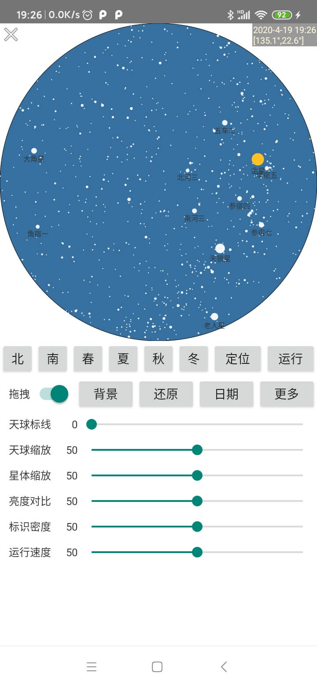
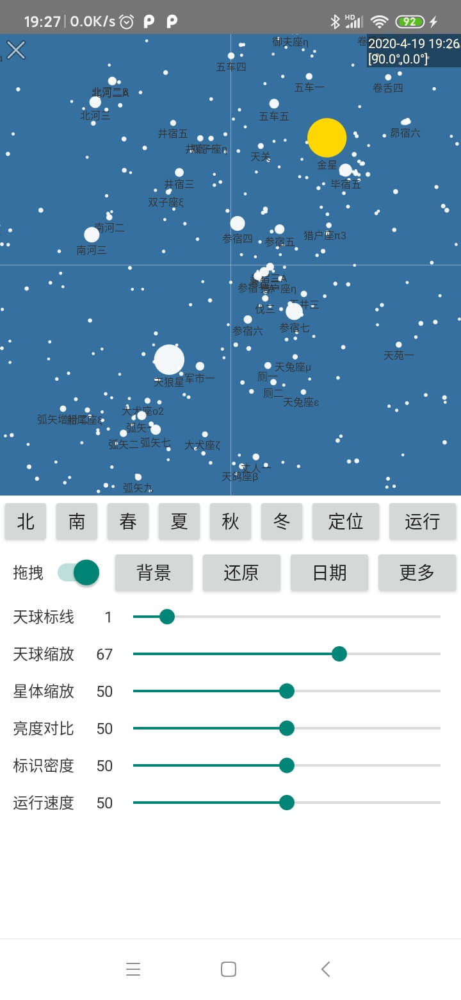

# AndroidStarrySky
A star display plug-in

## Installation Adding to project
1.Add the Jcenter repository to your build file
```
buildscript {
    repositories {
        jcenter()
    }
}
```
2.Add the dependency
```
dependencies {
    implementation 'gapp.season:skystar:1.0.0'
}
```

## Usage
```
//initialize when Application.onCreate()
SkyStar.config(isdev, defaultLuminance, pageTheme);

//Show StarrySky
SkyStar.openSkyBall(context);
```

## Preview
 
